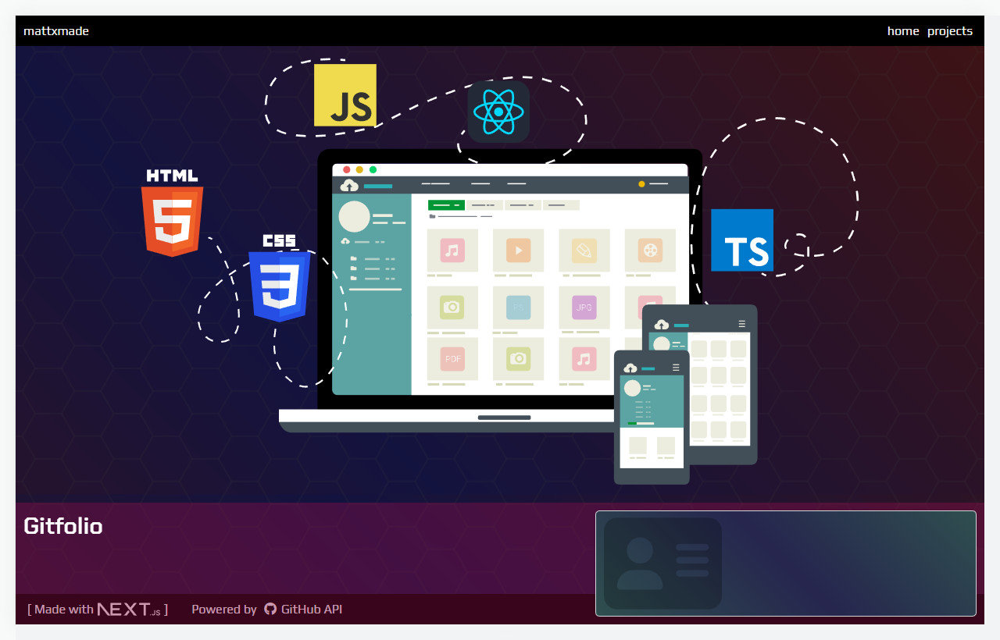

<a name="readme-top"></a>


# Gitfolio

[commnent]: <> (> ### GitHub API powered Portfolio made with Next.js)
> ### Developer Portfolio made with Next.js

<br>

<div align="center">
  <a href="#"></a>

###

  <table>
    <tbody>
      <tr>
      </tr>
      <tr>
        <!--<td align=center><strong>Technologies</strong></td>-->
        <td align="center">
          <a href="#"></a> 
          <a href="#"></a>     
          <a href="#"></a>
        </td>
    </tbody>
  </table> 
</div>

<br>

## About
Portfolio built with <a href="https://github.com/vercel/next.js"><strong>Next.js</strong></a> and powered by <a href="https://docs.github.com/en/rest"><strong>GitHub REST API</strong></a>. The project utilises <a href="https://github.blog/2022-10-18-introducing-fine-grained-personal-access-tokens-for-github"><strong>Fine-Grained Access Tokens</strong></a> to facilitate read-only access permission to reposistory data. Directories are navigated through a GitHub-esque user interface and source files can be viewed in-browser using the code viewer, built with <a href="https://github.com/uiwjs/react-codemirror"><strong>React-CodeMirror</strong></a>.

<br>

## Features
<table>
  <thead>
  </thead>
  <tbody>
    <tr><td colspan=2></td</tr>
    <tr>
      <td><strong>🔹 GitHub API</strong></td>
      <td>Access Git repository contents</td>
    </tr>
    <tr><td colspan=2></td></tr>
    <tr>
      <td><strong>🔹 Code Viewer</strong></td>
      <td>View Git source code</td>
    </tr>
    <tr><td colspan=2></td></tr>
    <tr>
      <td><strong>🔹 Responsive Design</strong></td>
      <td>Desktop and mobile friendly</td>
    </tr>
    <tr><td colspan=2></td></tr>
    <tr>
      <td width="25%"><strong>🔹 Next.js 13 App Router</strong></td>
      <td>Utilises React Server Components</td>
    </tr>
    <tr><td colspan=2><a href="#features"></a></td</tr>
  </tbody>
</table>

<br>
<p align="right">(<a href="#readme-top">back to top</a>)</p>

## Demo
Coming soon...

<br>
<p align="right">(<a href="#readme-top">back to top</a>)</p>

## Building Projects
### Pipeline
> #### Details 📡
> Project data is created using object literals and made available to application Components via props.
>
> #### Project Data Type Defintion
> ```ts
> type IProject = {
>   id: string;
>   repo: string;
>   title: string;
>   tech: Array<string>;
>   description: string;
>   details?: Array<string>;
>   features: Array<string>;
>   img: { src: StaticImageData; alt: string; transform?: string };
>   url: { live?: string; github?: string };
> }
> ```
> 
> #### Project React Server Component
> ```tsx
> /*
>   Project.tsx
>     ¬ React Server Component
>       ¬ minimal extract
> */
> 
> const Project = ({ project, ...props }: ProjectProps) => (
>   <Fragment>
>     <div id={`${project.id}-repo-drawer`} className="repo-drawer">
>       <Suspense key={project.id}>
>         <Repository id={project.id} repoName={project.repo} requireCommits={true} />
>       </Suspense>
>     </div>
> 
>     <aside className="project-card__aside">
>       <h2>{project.title}</h2>
>       <p>{`${project.description}`}</p>
> 
>       <div className="project-card-focus">
>         <h3>Features</h3>
>         <ul>
>           {project.features.map((feature, i) => (
>             <li key={"project-features_" + i}><p>{feature}</p></li>
>           ))}
>         </ul>
>       </div>
> 
>       <div className="project-card__tech">
>         <h3>Technologies</h3>
> 
>         <ul className="project-card__tech-icons-list">
>           {project.tech.map((name, i) => (
>             <li key={"project-tech_" + i}>{...}</li>
>           ))}
>         </ul>
>       </div>
> 
>       <div className="project-card__icons project-card-focus">
>         <a href={project.url.live}>{...}</a>
>         <a href={project.url.github}>{...}</a>
>         {...}
>       </div>
>     </aside>
> 
>     <div className={"project-card__image-container"}>
>       <Image src={project.img.src} alt={project.img.alt} />
>     </div>
>   </Fragment>
> );
> ```

<br>
<p align="right">(<a href="#readme-top">back to top</a>)</p>

## GitHub RESTful API: Overview
### Request & Response
Requests are made using <a href="https://octokit.github.io/rest.js/v20#repos-get-content"><strong>Octokit</strong></a>. A successful request repsonse returns the contents of the requested path. If no path is provided, the root contents of the Git repository will be returned.

A repository contains submodules, of which there are 4 possible types:

| Directory | File | Submodule | Symlink
:---: | :---: | :---| :---

<br>

More info about Repository Content via <a href="https://docs.github.com/en/rest/repos/contents?apiVersion=2022-11-28#get-repository-content"><strong/>GitHub docs</strong></a>

##

### Repository Contents
> #### Details 📡
With the introduction of <a href="https://github.com/acdlite/rfcs/blob/first-class-promises/text/0000-first-class-support-for-promises.md#example-await-in-server-components"><strong>Async Server Components</strong></a>, data can be fetched and consumed where it is needed.
 
Using this pattern, repository content is fetched directly from within the <strong>Repository Async Component</strong> by invoking the <a href="https://github.com/mattxmade/gitfolio"><strong>handleRepoContentRequest</strong></a> async function.

###

#### Respository: Async Server Component
```tsx
/*
  Repository.tsx
    ¬ minimal example
*/

const Repository = async ({ id, repoName }: Props) => {
  const request = (await handleRepoContentRequest( repoName, requireCommits)) as Response;
  
  const response = (await request.json()) as IGitResponse;
  const gitRepo = response.data as IRepository;

  return { gitRepo ? <Contents id={id} contents={gitRepo.contents} /> : null}
}
```

#### handleRepoContentRequest: Async function
```ts
/*
  github.ts
    ¬ minimal example
*/

const handleRepoContentRequest = async (request: string, rCommits: boolean) => {
  const reqRootContents = { headers, path: "", repo: request, owner: ownerConfig.owner };

  try {
    const rootContents = await octokit.rest.repos.getContent(reqRootContents);

   response.data = rootContents.data;
   response.status = rootContents.status;
   response.message = "Repository contents fetched successfully";
  
  } catch (error: any) {
    response.status = error.status;
    response.message = error.response.data.message;
  }
}
```

<br>
<p align="right">(<a href="#readme-top">back to top</a>)</p>

##

### Environment

<a href="#"></a>

### Build Tools

<a href="#"></a>
<a href="#"></a>

### Developer Tools

<a href="#"></a>
<a href="#"></a>

##

### Deployment

<a href="#"></a>

<p align="right">(<a href="#readme-top">back to top</a>)</p>
